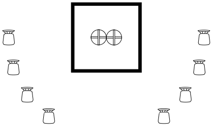

**Pre-wedding Checklist**
|Done?|Task|Cost|
|-|-|-|
|X|Obtain Wedding Bands|425|
|-|Engagement Photos|0|
|-|Obtain Marriage License|0|
|-|Get legally Married|0|
|-|Obtain Wedding Dress|0|
|-|Reserve the location|0|
|-|Book Photographer|0|
|-|Book Catering|0|
|-|Order Chairs From Amazon|0|
|-|Order Cake Supplies|0|
|-|Plan Playlist and Speakers|0|
|-|Plan Honeymoon Activities|0|

---

**Clothing**
-   Bride and Groom:
    -   Groom:  Buttoned Up Black Suit and Tie
    -   Bride:  White Sleeved Wedding Dress
-   Family:
    -   Men:    Suit, Tie Optional
    -   Women:  Semi-Formal Clothing

---

**Seating Chart**
-   Family sits in a semi-circle around us
-   Leave space for the photographer\

---

**First Dance**\
Slow song, no choreographed dancing
-   [Elvis Presley - Can't Help Falling in Love](https://open.spotify.com/track/44AyOl4qVkzS48vBsbNXaC)
-   [Rod Stewart - Have I Told You Lately](https://open.spotify.com/track/6mIY6O7uNGgVqOoX70UAYh)
-   [Jack Johnson - Better Together](https://open.spotify.com/track/0x1AxbzEDQyX6feQW99lF0)